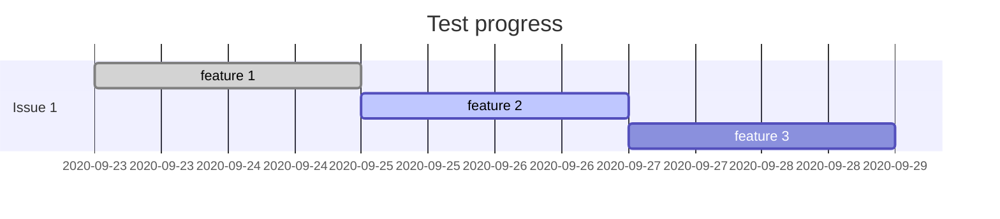

# ANZ joint lab test

## Personal information

| Name   | Student ID    |
| ------ | ------------- |
| 刘嘉文 | 2020090916025 |

## Test progress

> *Show your progress below.*

> *Or write it directly:*
***FINISHED:***
...
...

---
## Answer sheet

> *Write your answer below. (if asked)*
1.对git版本管理的理解：
分布式版本控制系统即所有计算机都有一个本地的库，可方便离线工作，团队合作。同时避免了服务器丢失数据等问题，但安全性可能下降，数据易被窃取。
2.如何向远程提交你本地的第一份添加的代码呢？
先创建git库，然后将本地库与远程库关联，提交代码到缓存区，提交到仓库，提交到远程仓库。
3.在项目开发中，你发现自己提交的代码出现了重大错误，将如何使用“撤回”功能？
在库里面找到history，即可找到之前提交的代码，重新上传之前的代码即可实现“撤回”功能。
4.在什么情况下会发生代码冲突？你又可以如何解决呢？
两个程序猿对同一文件进行修改；手动合并重新提交。

